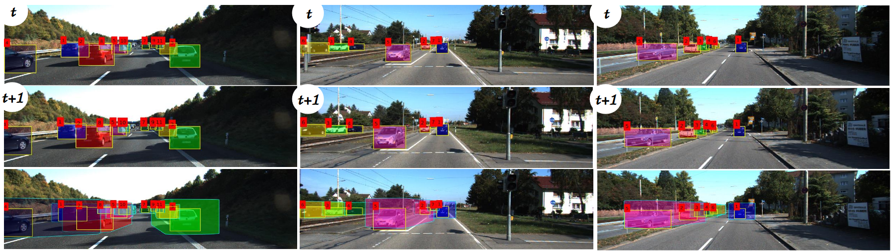

# MOTBeyondPixels



This repository contains code and data required to reproduce the results in the ICRA 2018 paper

## Beyond Pixels: Leveraging Geometry and Shape Cues for Online Multi-Object Tracking
### Sarthak Sharma<sup>\*</sup>, Junaid Ahmed Ansari<sup>\*</sup>, [J. Krishna Murthy](https://krrish94.github.io), and [K. Madhava Krishna](http://robotics.iiit.ac.in)
> <sup>\*</sup> The first two authors contributed equally to the work.

### [Project Page](https://junaidcs032.github.io/Geometry_ObjectShape_MOT/)
> The project page has more qualitative results, and links to data.

If you find the code/data useful in your experiments, kindly consider citing

```
@inproceedings{BeyondPixels_ICRA2018,
  title={Beyond Pixels: Leveraging Geometry and Shape Cues for Online Multi-Object Tracking},
  author={Sarthak Sharma, Junaid Ahmed Ansari, J. Krishna Murthy, K. Madhava Krishna},
  booktitle = {Procedings of the IEEE International Conference on Robotics and Automation},
  year={2018}
}
```


## Running the demo scripts

We provide demo scripts for running code and visualizing results on sequences from the KITTI Tracking dataset.

To run a demo script that shows representative results on short snippets from the train and test splits run

```
main_script_train.m
main_script_test.m
```
> IMPORTANT: You need to have the `Data` folder initialized, before you can run this demo.
> See below for details.


Before you can run this, however, make sure you download the requisite CNN appearance features and rectified images by running the following script.
```
sh download_data.sh
```
Or you can download it from [here](https://drive.google.com/open?id=1ZR1qEf2qjQYA9zALLl-ZXuWhqG9lxzsM) and place it (after unzipping it) in the parent directory.

## Using our result files

To falcilitate comparision, we have also released our results on the KITTI Tracking benchmark (train and test splits). The result files, in the format specified by the evaluation server, can be downloaded from [here](https://drive.google.com/open?id=0B-9NOTtQ3zTQUTJORXlyTEZzR0M4UG1jUmRvS2ZCcE5ZUFI0)

> DISCLAIMER: The result files have been released *in good faith*, in the spirit of reproducible research.
> No misuse is permitted.

## Misc. Remarks

We release release object detections obtained (and filtering scripts for non-maxima suppression, along with parameters used) for all train and test sequences. We report results obtained by running [RRC-Net](https://arxiv.org/abs/1704.05776) \[[code](https://github.com/xiaohaoChen/rrc_detection)\] on KITTI Tracking data. They can be accessed in the `Data` directory.

We also release odometry estimates obtained from ORB-SLAM. Note that, since we used monocular ORB-SLAM, odometry estimates were obtained *to-scale*. To get rid of the scale factor ambiguity, we empirically estimate a scale factor by four-fold cross-validation over the train set. Once this scale factor is estimated, we use the same factor across all train and test sequences in the results reported. These can be found in the `Data` directory too.
